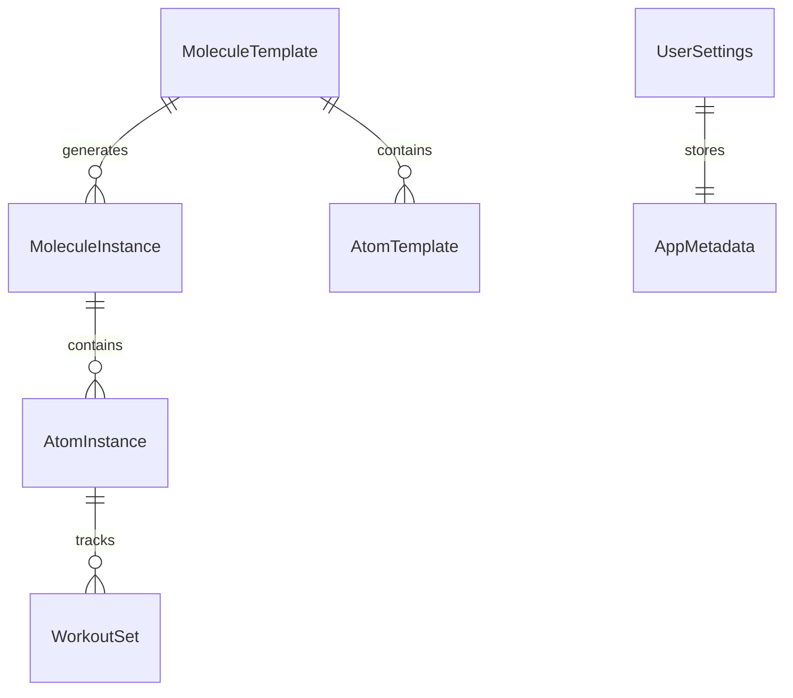

# Protocol — Architecture

> Last Updated: January 7, 2026 | Schema Version: 3.0.0

## Overview

Protocol is a native iOS habit tracking app built with **SwiftUI** and **SwiftData**. It uses a "Molecule → Atom" metaphor where routines (Molecules) contain individual tasks (Atoms).

---

## Project Structure

```
Protocol/
├── Protocol/                     # Main App Target
│   ├── Data/                     # Data Layer
│   │   ├── AppMigrationPlan.swift   # Schema versioning
│   │   ├── DataController.swift     # ModelContainer setup
│   │   └── SchemaVersions.swift     # Legacy reference
│   ├── Models/                   # SwiftData Models
│   │   ├── MoleculeTemplate.swift   # Recurring routine definition
│   │   ├── MoleculeInstance.swift   # Single occurrence
│   │   ├── AtomTemplate.swift       # Task blueprint
│   │   ├── AtomInstance.swift       # Task occurrence
│   │   ├── WorkoutSet.swift         # Exercise tracking
│   │   ├── UserSettings.swift       # App preferences
│   │   ├── AppMetadata.swift        # JSON config helper
│   │   ├── SyncableRecord.swift     # Sync protocol
│   │   └── RecurrenceTypes.swift    # Enums
│   ├── Views/                    # UI Components
│   ├── Helpers/                  # Services & Managers
│   └── ProtocolApp.swift         # App Entry Point
├── ProtocolWidget/               # Widget Extension
├── ProtocolTests/                # Unit Tests
└── Protocol.xcodeproj
```

---

## Data Model



### Core Models

| Model | Purpose |
|-------|---------|
| `MoleculeTemplate` | Defines a recurring routine (title, schedule, alerts) |
| `MoleculeInstance` | A single occurrence of a routine on a specific date |
| `AtomTemplate` | Blueprint for a task within a routine |
| `AtomInstance` | A task occurrence with completion status |
| `WorkoutSet` | Individual set data for exercise atoms |
| `UserSettings` | App-wide preferences with JSON metadata |

### Flexible Metadata Pattern

`UserSettings.metadataJSON` stores a `Codable` struct (`AppMetadata`) as JSON. This allows adding new preferences without database migrations.

```swift
let settings = UserSettings.current(in: context)
settings.updateMetadata { $0.theme = .dark }
```

---

## Schema Migration

We use **SwiftData's VersionedSchema** for safe migrations:

```swift
enum SchemaV3: VersionedSchema {
    static var versionIdentifier = Schema.Version(3, 0, 0)
    static var models: [any PersistentModel.Type] { [...] }
}

enum AppMigrationPlan: SchemaMigrationPlan {
    static var schemas: [any VersionedSchema.Type] { [SchemaV1.self, SchemaV2.self, SchemaV3.self] }
    static var stages: [MigrationStage] { [migrateV1toV2, migrateV2toV3] }
}
```

**Adding a new schema version:**
1. Create `SchemaVN` with updated models.
2. Add a migration stage to `AppMigrationPlan.stages`.
3. Update `schemas` to include all versions.

---

## Schema Migration History

### V3.0.0 (January 7, 2026) — Current

**Changes:**
- `AtomTemplate`: Added `updatedAt: Date` for sync tracking
- All models conforming to `SyncableRecord` protocol for cloud sync

**Backup Restoration Behavior:**
When restoring a pre-V3 backup, `AtomTemplate.updatedAt` will be set to restore time (`Date()`), NOT the original modification time. This is expected because:
- The field didn't exist in older schemas
- Future edits will update it correctly
- For sync purposes, "restored now" is an acceptable baseline

---

### V2.0.0 — Icon Customization

**Changes:**
- `MoleculeTemplate`: Added `iconSymbol`, `iconFrameRaw`
- `AtomTemplate`: Added `iconSymbol`, `iconFrameRaw`

---

### V1.0.0 — Initial Schema

**Models:** MoleculeTemplate, MoleculeInstance, AtomTemplate, AtomInstance, WorkoutSet, UserSettings

---

## Key Services

| Service | File | Responsibility |
|---------|------|----------------|
| `DataController` | `DataController.swift` | Manages `ModelContainer`, handles recovery |
| `MoleculeService` | `MoleculeService.swift` | CRUD for molecules, instance generation |
| `NotificationManager` | `NotificationManager.swift` | Local notifications scheduling |
| `BackgroundScheduler` | `BackgroundScheduler.swift` | Background refresh tasks |
| `OnboardingManager` | `OnboardingManager.swift` | First-launch seeding |
| `GoogleAuthManager` | `GoogleAuthManager.swift` | Google Sign-In & OAuth |

---

## Widget

The **ProtocolWidget** displays today's upcoming molecules. It uses raw SQLite queries for memory efficiency:

- **App Group**: `group.com.Toofan.Toofanprotocol.shared`
- **Data Access**: Direct SQLite (no SwiftData stack to reduce memory)

---

## Testing

| Test File | Coverage |
|-----------|----------|
| `DataControllerRecoveryTests.swift` | Database corruption recovery |

Run tests: **Cmd+U** in Xcode.

---

## Build Tags

| Tag | Description |
|-----|-------------|
| `stable-migration-v1` | Pre-cleanup baseline after migration fix |

---

## Security & Privacy

- **No Analytics**: Zero third-party tracking.
- **Offline First**: All data stored locally via SwiftData.
- **Google Sign-In**: Optional, for Drive backup only. No data sent without user action.

