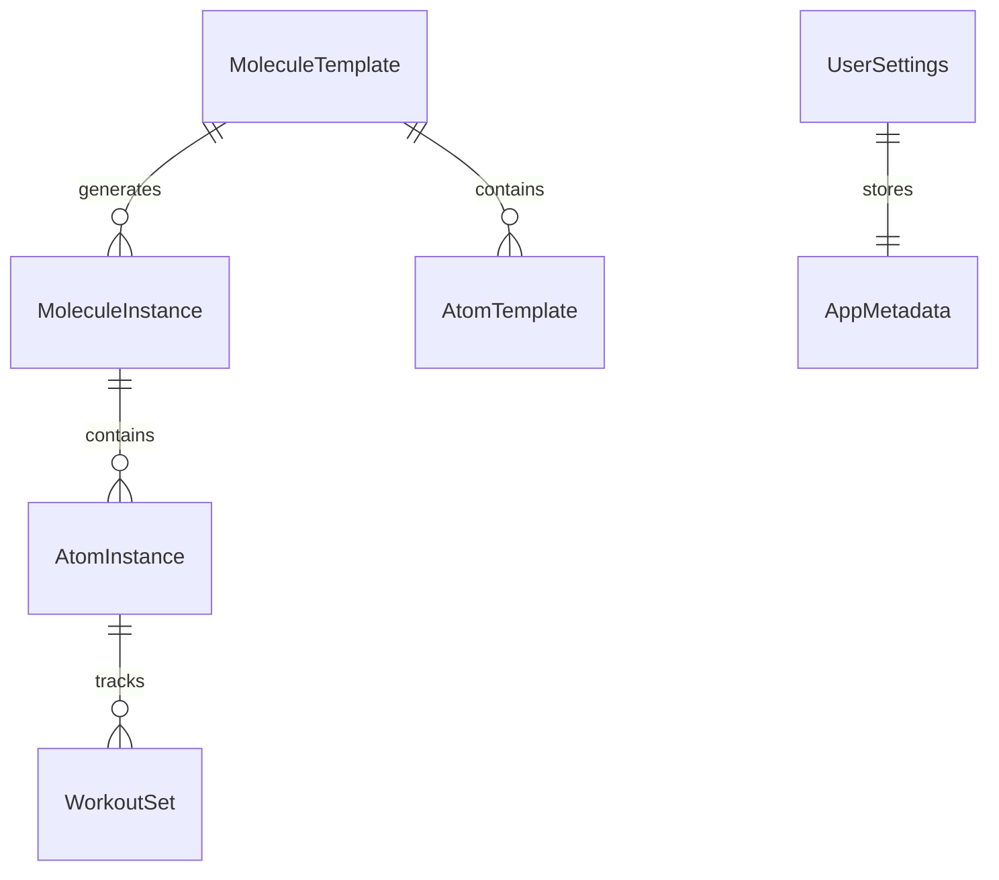

# Protocol — Architecture

> Last Updated: January 7, 2026 | Schema Version: 3.0.0

## Overview

Protocol is a native iOS habit tracking app built with **SwiftUI** and **SwiftData**. It uses a "Molecule → Atom" metaphor where routines (Molecules) contain individual tasks (Atoms).

---

## Project Structure

```
Protocol/
├── Protocol/                     # Main App Target
│   ├── Data/                     # Data Layer
│   │   ├── AppMigrationPlan.swift   # Schema versioning
│   │   ├── DataController.swift     # ModelContainer setup
│   │   └── SchemaVersions.swift     # Legacy reference
│   ├── Models/                   # SwiftData Models
│   │   ├── MoleculeTemplate.swift   # Recurring routine definition
│   │   ├── MoleculeInstance.swift   # Single occurrence
│   │   ├── AtomTemplate.swift       # Task blueprint
│   │   ├── AtomInstance.swift       # Task occurrence
│   │   ├── WorkoutSet.swift         # Exercise tracking
│   │   ├── UserSettings.swift       # App preferences
│   │   ├── AppMetadata.swift        # JSON config helper
│   │   ├── SyncableRecord.swift     # Sync protocol
│   │   └── RecurrenceTypes.swift    # Enums
│   ├── Views/                    # UI Components
│   ├── Helpers/                  # Services & Managers
│   └── ProtocolApp.swift         # App Entry Point
├── ProtocolWidget/               # Widget Extension
├── ProtocolTests/                # Unit Tests
└── Protocol.xcodeproj
```

---

## Data Model



### Core Models

| Model | Purpose |
|-------|---------|
| `MoleculeTemplate` | Defines a recurring routine (title, schedule, alerts) |
| `MoleculeInstance` | A single occurrence of a routine on a specific date |
| `AtomTemplate` | Blueprint for a task within a routine |
| `AtomInstance` | A task occurrence with completion status |
| `WorkoutSet` | Individual set data for exercise atoms |
| `UserSettings` | App-wide preferences with JSON metadata |

### Flexible Metadata Pattern

`UserSettings.metadataJSON` stores a `Codable` struct (`AppMetadata`) as JSON. This allows adding new preferences without database migrations.

```swift
let settings = UserSettings.current(in: context)
settings.updateMetadata { $0.theme = .dark }
```

---

## Schema Migration

We use **SwiftData's Lightweight Migration** for flexibility and speed. Complex `VersionedSchema` logic has been removed in favor of a flat schema approach:

```swift
let schema = Schema([
    MoleculeTemplate.self,
    MoleculeInstance.self,
    AtomTemplate.self,
    AtomInstance.self,
    WorkoutSet.self,
    UserSettings.self,
    PersistentAuditLog.self
])
```

**Migration Strategy:**
- **Additions**: New properties (like `iconSymbol`) must have default values. SwiftData handles column addition automatically.
- **Deletions**: Unused properties are ignored.
- **Renames**: Requires custom `Stage` logic (currently not implemented; avoid renaming).

---

## Schema History

### V3.0.0 (January 7, 2026) — Current
**Major Feature:** Cloud Sync & Soft Delete
- Added `SyncableRecord` conformance (IDs, `updatedAt`).
- Added `PersistentAuditLog` model for atomic transaction logging.
- `MoleculeTemplate`: Added `isArchived`.

### V2.0.0
- Added `iconSymbol`, `iconFrameRaw` to templates.

### V1.0.0
- Initial schema.

---

### V2.0.0 — Icon Customization

**Changes:**
- `MoleculeTemplate`: Added `iconSymbol`, `iconFrameRaw`
- `AtomTemplate`: Added `iconSymbol`, `iconFrameRaw`

---

### V1.0.0 — Initial Schema

**Models:** MoleculeTemplate, MoleculeInstance, AtomTemplate, AtomInstance, WorkoutSet, UserSettings

---

## Key Services

| Service | File | Responsibility |
|---------|------|----------------|
| `DataController` | `DataController.swift` | Manages `ModelContainer`, handles recovery |
| `MoleculeService` | `MoleculeService.swift` | CRUD for molecules, instance generation |
| `NotificationManager` | `NotificationManager.swift` | Local notifications scheduling |
| `BackgroundScheduler` | `BackgroundScheduler.swift` | Background refresh tasks |
| `OnboardingManager` | `OnboardingManager.swift` | First-launch seeding |
| `GoogleAuthManager` | `GoogleAuthManager.swift` | Google Sign-In & OAuth |

---

## Cloud Sync & Conflict Resolution

The sync architecture is designed to be robust and prevent data loss when using the app on multiple devices.

### Device Identity
- **`DeviceIdentity.swift`**: Establishes a stable, unique ID for each device using `identifierForVendor` with a Keychain fallback. This ensures the app can distinguish between different devices (e.g., an iPhone and an iPad) even after re-installs.

### Device Registry
- **`device_registry.json`**: A file stored in the user's Google Drive app folder that acts as the source of truth for all devices linked to an account.
- It tracks each device's ID, name, and last sync timestamp.

### Sync Workflow & Conflict Detection
1.  **Sync Triggered**: User initiates a sync.
2.  **Simulator Block**: Sync is automatically blocked if running on a simulator to prevent accidental data overwrites during development.
3.  **Registry Check**: `SyncEngine` fetches `device_registry.json` from Google Drive.
4.  **Conflict Detection**:
    - If the current device's ID is **not** in the registry and other devices **are**, a conflict is flagged. This means a new device is trying to sync to an existing cloud dataset.
    - The user is shown the `ConflictResolutionView`.
5.  **User Resolution**: The user must choose one of two paths:
    - **Use This Device's Data**: Local data is uploaded to the cloud, overwriting the existing remote data. The new device is added to the registry.
    - **Use Cloud Data**: Remote data is downloaded, overwriting all local data. The new device is added to the registry.
6.  **Standard Sync**: If no conflict is detected, the normal sync process (downloading remote changes, then uploading local changes) proceeds. The device's `lastSyncDate` is updated in the registry.

---

## Widget

The **ProtocolWidget** displays today's upcoming molecules. It uses raw SQLite queries for memory efficiency:

- **App Group**: `group.com.Toofan.Toofanprotocol.shared`
- **Data Access**: Direct SQLite (no SwiftData stack to reduce memory)

---

## Testing

| Test File | Coverage |
|-----------|----------|
| `DataControllerRecoveryTests.swift` | Database corruption recovery |

Run tests: **Cmd+U** in Xcode.

---

## Build Tags

| Tag | Description |
|-----|-------------|
| `stable-migration-v1` | Pre-cleanup baseline after migration fix |

---

## Security & Privacy

- **No Analytics**: Zero third-party tracking.
- **Offline First**: All data stored locally via SwiftData.
- **Google Sign-In**: Optional, for Drive backup only. No data sent without user action.

