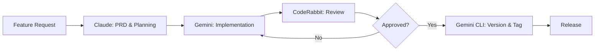

# Protocol

> **Build Your Empire, One Habit at a Time.**

Protocol is a native iOS application designed to help users build **compound routines**. Unlike traditional habit trackers that treat goals as isolated checkboxes, Protocol organizes them into systems ("Molecules") composed of individual actions ("Atoms").


---

## 📑 Table of Contents

<details>
<summary><strong>Click to expand</strong></summary>

- [🧪 Core Concepts](#-core-concepts)
- [✨ Features](#-features)
  - [Core Habit Tracking](#core-habit-tracking)
  - [Analytics & Insights](#analytics--insights)
  - [Workout & Exercise](#workout--exercise)
  - [Data Management](#data-management)
  - [Gamification](#gamification)
  - [Organization](#organization)
- [🛠 Tech Stack](#-tech-stack)
- [🏗 Architecture](#-architecture)
- [🚀 Getting Started](#-getting-started)
- [🧪 Testing](#-testing)
- [🔒 Privacy & Security](#-privacy--security)
- [🤖 AI-Assisted Development](#-ai-assisted-development)
  - [🧠 Model Optimization Philosophy](#-model-optimization-philosophy)
  - [👥 Virtual Team Orchestration](#-virtual-team-orchestration)
  - [🛠 AI Tools & Workflows](#-ai-tools--workflows-1)
  - [💡 Key Learnings](#-key-learnings)
- [📄 License](#-license)
- [🏷 Version History](#-version-history)
- [📚 Additional Documentation](#-additional-documentation)

</details>

---

## 🧪 Core Concepts

| Concept | Description |
|---------|-------------|
| **Molecule** | A complete routine (e.g., "Morning Protocol") scheduled at a specific time |
| **Atom** | A single task inside a Molecule (e.g., "Drink Water", "Read 10 mins") |
| **Instance** | A specific occurrence of a Molecule on a given date |
| **Compound Growth** | Consistent execution builds streaks and momentum |

---

## ✨ Features

### Core Habit Tracking
- 📦 **Contextual Tracking** — Group related habits into powerful routines
- ⏰ **Smart Reminders** — Multiple alert offsets per routine (15 min, 1 hour, etc.)
- ☁️ **Cloud Sync (Beta)** — Bidirectional Google Drive sync with conflict resolution
- 🛡️ **Data Safety** — Orphan Recovery tools, Soft-Delete archiving, and Atomic Audit Logs
- 📱 **Home Screen Widget** — View and complete tasks directly from home screen
- 💾 **Offline First** — All data stored locally with SwiftData
- 🎨 **All-Day Events** — Support for habits without specific times
- 🔄 **Flexible Recurrence** — Daily, weekly, specific days, and custom patterns

### Analytics & Insights
- 📊 **Completion Trends** — Weekly bar charts showing daily completion rates
- 🗓️ **Consistency Heatmaps** — GitHub-style activity visualization
- 📈 **Streak Tracking** — Current and longest streak calculations
- ⏱️ **Time-of-Day Analysis** — Discover your most productive hours
- 🔍 **Advanced Querying** — Efficient analytics engine with optimized date filtering

### Workout & Exercise
- 🏋️ **Workout Tracking** — Sets, reps, weight logging for exercise atoms
- 💪 **Progress History** — Track improvement over time

### Rich Media
- 📸 **Media Capture** — Attach photos, videos, and audio notes to any task
- 💤 **Snoring Detection** — Analyze sleep quality with audio processing and intensity scoring
- 🖼️ **Gallery View** — Browse all your captured moments in a visual grid

### Data Management
- 🏗️ **Blueprint Architect** — Bulk import habits via CSV (Format: `Time,Name,Atoms|Separated,IsAllDay`)
- 💿 **Encrypted Backups** — AES-GCM encrypted local backups with password protection
- ☁️ **Device-Aware Sync** — Google Drive sync that recognizes multiple devices, preventing conflicts and allowing users to resolve them by choosing between local or cloud data.
- 📋 **Audit Logging** — Complete history of data changes for debugging
- 🗂️ **Archive System** — Hide completed routines without losing history
- 🔎 **Orphan Manager** — Find and repair data integrity issues

### Gamification
- 🎉 **Celebrations** — Confetti animations on 100% daily completion
- 👏 **Sound Effects** — Satisfying audio feedback on task completion
- 🏆 **Perfect Day Tracking** — Special recognition for completing all tasks

### Organization
- 🗂️ **Compounds** — Organize molecules into categories (Fitness, Wellness, etc.)
- 🎨 **Custom Icons** — Personalize molecules and atoms with SF Symbols
- 🏷️ **Icon Frames** — Multiple visual styles for icons

---

## 🛠 Tech Stack

| Layer | Technology |
|-------|------------|
| **UI** | SwiftUI, SwiftCharts |
| **Data** | SwiftData with VersionedSchema (V3.0.0) |
| **Widgets** | WidgetKit with direct SQLite access |
| **Background** | BGTaskScheduler |
| **Notifications** | UserNotifications (Local) |
| **Cloud** | Google Drive API, Google Sign-In |
| **Security** | CryptoKit (AES-GCM), Keychain, FileProtection |
| **Logging** | OSLog with custom categories |

---

## 🏗 Architecture

See [ARCHITECTURE.md](ARCHITECTURE.md) for detailed documentation.

### Project Structure

```
Protocol/
├── Protocol/                 # Main App Target
│   ├── Data/                 # DataController, Migration Plan
│   ├── Models/               # SwiftData @Model classes (11 files)
│   ├── Views/                # SwiftUI Views (31 files)
│   ├── ViewModels/           # MVVM ViewModels (6 files)
│   ├── Helpers/              # Services & Managers (18 files)
│   ├── Services/             # Domain services
│   └── Extensions/           # Swift extensions
├── ProtocolWidget/           # Home Screen Widget
├── ProtocolTests/            # Unit Tests (12 test files)
└── Protocol.xcodeproj
```

### Key Services

| Service | Responsibility |
|---------|----------------|
| `MoleculeService` | CRUD operations, instance generation, auto-scheduling |
| `DriveService` | Google Drive sync, conflict resolution, ETL pipelines |
| `SyncEngine` | Orchestrates sync operations with queue management |
| `BackupManager` | Encrypted backup creation and restoration |
| `AnalyticsQueryService` | Efficient date-range queries for insights |
| `NotificationManager` | Local notification scheduling and management |
| `AuditLogger` | File-based audit trail for debugging |
| `GoogleAuthManager` | OAuth 2.0 flow for Google Sign-In |

### Data Model

```
MoleculeTemplate → MoleculeInstance → AtomInstance → WorkoutSet
                 ↳ AtomTemplate
```

---

## 🚀 Getting Started

### Prerequisites
- Xcode 15+
- iOS 17+ Simulator or Device

### Installation

```bash
git clone https://github.com/yourusername/protocol.git
cd protocol
open Protocol.xcodeproj
```

### Configuration

The app uses App Groups for widget data sharing:
- **App Group ID**: `group.com.Toofan.Toofanprotocol.shared`

Ensure both targets (Protocol and ProtocolWidgetExtension) have this capability enabled.

---

## 🧪 Testing

### Test Suite Overview

| Test File | Coverage |
|-----------|----------|
| `AuditLoggerTests.swift` | Audit logging functionality (12 tests) |
| `AuditLogViewModelTests.swift` | ViewModel filtering and state |
| `BackupManagerTests.swift` | Encrypted backup/restore (7 tests) |
| `DataControllerRecoveryTests.swift` | Database corruption recovery (3 tests) |
| `DataIntegrityTests.swift` | Core data operations |
| `ModelTests.swift` | Model computed properties (18 tests) |
| `MoleculeServiceTests.swift` | Service layer operations (7 tests) |
| `MoleculeTemplateTests.swift` | Template logic |
| `SyncDataIntegrityTests.swift` | Sync data correctness |
| `SyncJSONRoundTripTests.swift` | Serialization integrity |
| `SyncQueueManagerTests.swift` | Queue operations |

### Running Tests

```bash
# Run all tests
xcodebuild test -scheme Protocol -destination 'platform=iOS Simulator,name=iPhone 16 Pro'
```

Or press **Cmd+U** in Xcode.

See [QA_CHECKLIST.md](QA_CHECKLIST.md) for comprehensive manual testing procedures.

---

## 🔒 Privacy & Security

Protocol is **privacy-first** with enterprise-grade security:

### Data Protection
- ✅ **Offline First** — All data stored locally via SwiftData
- ✅ **File Protection** — Database uses `.completeUntilFirstUserAuthentication`
- ✅ **Backup Encryption** — AES-GCM encryption with password-derived keys

### Privacy
- ✅ **No Analytics** — Zero third-party tracking or telemetry
- ✅ **No Network Requests** — Fully functional in airplane mode
- ✅ **No Accounts Required** — Works without any sign-up

### Optional Cloud (User-Initiated Only)
- ☁️ **Google Drive Sync** — Only if user explicitly signs in
- 🔐 **OAuth 2.0** — Secure authentication via Google Sign-In
- 📁 **User's Own Drive** — Data stored in user's personal cloud storage

---

## 🤖 AI-Assisted Development

This project showcases modern AI-augmented software development workflows. By integrating multiple AI tools across the development lifecycle, this project demonstrates how to leverage AI for enhanced productivity, code quality, and streamlined version control.

### 🧠 Model Optimization Philosophy

A key insight driving this project: **different AI models excel at different tasks**. Rather than using one model for everything, I strategically matched models to their strengths:

| Model | Optimized For | Persona Used |
|-------|---------------|--------------|
| **Claude Opus** | Long-form reasoning, documentation, strategic planning | Product Manager |
| **Gemini 2.5 Pro** | Code implementation, debugging, refactoring | Senior Software Engineer |
| **Gemini CLI** | Git operations, version control workflows | DevOps Engineer |
| **CodeRabbit** | Automated PR review, static analysis | Code Reviewer |

### 👥 Virtual Team Orchestration

One of the most powerful techniques employed was **persona-based AI orchestration** — using AI agents with defined roles to simulate a full development team:

| Persona | Responsibilities |
|---------|------------------|
| **Product Manager** | PRD creation, feature prioritization, user story development, acceptance criteria |
| **Lead iOS Architect** | System design, architecture decisions, pattern selection, technical debt assessment |
| **Senior SWE** | Implementation, code quality, debugging, performance optimization |
| **QA Lead** | Test strategy, test case generation, edge case identification, regression planning |

#### How It Works

These personas aren't just labels — they represent **distinct thinking modes** that challenge each other:

1. **PM pitches a feature** → Architect challenges feasibility → SWE estimates complexity → QA identifies test gaps
2. **Architect proposes design** → PM validates business alignment → QA flags testability concerns → SWE reviews implementation viability
3. **SWE implements code** → QA reviews for edge cases → Architect validates pattern adherence → PM confirms acceptance criteria

This creates a **collaborative friction** that catches issues early, similar to a real cross-functional team.

#### Decisions Made Through Virtual Team

- **Business Logic** — PM-driven user stories validated by Architect for technical soundness
- **Architecture** — Architect proposals challenged by SWE for implementation complexity
- **Testing Strategy** — QA-defined coverage reviewed by Architect for completeness
- **Performance Trade-offs** — SWE recommendations balanced against PM's user experience priorities
- **Security Considerations** — Cross-team review ensuring defense in depth
- **API Design** — Collaborative design ensuring usability and maintainability
- **Data Model Evolution** — Schema changes vetted for migration safety and future flexibility

### 🛠 AI Tools & Workflows

| Tool | Role | Key Capabilities |
|------|------|------------------|
| **CodeRabbit** | Automated Code Review | PR analysis, bug detection, code quality suggestions, security scanning |
| **Gemini CLI** | Git & Version Management | Stashing, tagging, branch management, commit message generation, conflict resolution |
| **Gemini 2.5 Pro** | Core Development | Feature implementation, debugging, architecture decisions, code refactoring |
| **Claude Opus** | Documentation & Testing | PRD development, test case generation, unit test implementation |

### 🔄 Development Workflow



### 📋 CodeRabbit Integration

CodeRabbit provides automated code review on every pull request:
- **Static Analysis** — Identifies potential bugs and code smells
- **Security Scanning** — Flags vulnerabilities and unsafe patterns
- **Best Practices** — Suggests idiomatic Swift patterns and improvements
- **Documentation** — Recommends missing documentation and comments

### 🎯 Gemini CLI for Git Management

Gemini CLI streamlines version control operations:
- **Smart Stashing** — Context-aware stash management for work-in-progress
- **Semantic Tagging** — Automated version tagging with changelog generation
- **Commit Assistance** — Generates meaningful commit messages from diffs
- **Branch Workflows** — Handles branch creation, merging, and cleanup
- **Conflict Resolution** — AI-assisted merge conflict resolution

### 🏗 Antigravity IDE

All development is conducted within Google's **Antigravity IDE**, which provides:
- Integrated AI assistance across the entire development environment
- Seamless tool orchestration between multiple AI models
- Context-aware suggestions based on project structure
- Real-time collaboration between human developer and AI agents

### 💡 Key Learnings

1. **Model Specialization** — Matching AI models to their strengths yields better results than using one model for everything
2. **Persona-Based Thinking** — Role-playing different stakeholders surfaces blind spots and improves decision quality
3. **Collaborative Friction** — Having personas challenge each other mimics real team dynamics and catches issues early
4. **Review-First Development** — CodeRabbit catches issues before human review, improving code quality
5. **Version Control Automation** — Gemini CLI reduces friction in git workflows, enabling faster iteration
6. **Documentation as Code** — AI-generated documentation stays synchronized with implementation

---

## 📄 License

This project is licensed under the MIT License - see the [LICENSE](LICENSE) file for details.

---

## 🏷 Version History

| Version | Date | Notes |
|---------|------|-------|
| 3.0.0 | Jan 2026 | Google Drive Sync, Encrypted Backups, Audit Logging, Comprehensive Test Suite |
| 2.0.0 | Jan 2026 | Analytics Overhaul (Heatmaps, Trends), Performance Refactor, Icon Customization |
| 1.1.0 | Jan 2026 | Blueprint Architect CSV import, Gamification, Compounds |
| 1.0.0 | Jan 2026 | Initial release with migration safety |

---

## 📚 Additional Documentation

- [ARCHITECTURE.md](ARCHITECTURE.md) — Detailed technical architecture
- [ANALYTICS_ENGINE.md](ANALYTICS_ENGINE.md) — Analytics query layer documentation
- [QA_CHECKLIST.md](QA_CHECKLIST.md) — Pre-release testing procedures
- [V2_PLAN.md](V2_PLAN.md) — Future roadmap (Fitbit integration, LLM chatbot)